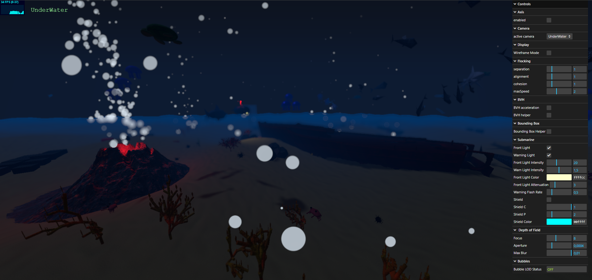

# SGI 2025/2026

## Group T03G01
| Name             | Number    | E-Mail             |
| ---------------- | --------- | ------------------ |
| Lucas Faria      | 202207540 | up202207540@up.pt  |
| Alexandre Lopes  | 202207015 | up202207015@up.pt  |
| Pedro Borges     | 202207552 | up202207552@up.pt  |
----

## Projects

### [PW1 - ThreeJS Basics](pw1)

The objective of this project was to design and implement a 3D scene using THREE.js, utilizing the key concepts learned in class. The scene integrates various types of geometries, materials, textures, and lighting techniques, along with appropriate transformations to create a visually engaging and technically complete 3D environment.

- Main Highlights
  - Implementation of multiple geometry types (Box, Sphere, Cone, Cylinder, Torus, Plane).
  - Use of diverse materials and textures.
  - Use of diverse types of lighting sources (Point Light, Ambient Light, Directional Light and Spot Light).
  - Transformations such as translation, rotation and scaling applied to the objects.
  - Organized and modular scene structure for readability and extensibility.
- Scene
  - The scene depicts a small 3D study room featuring a textured wooden floor and walls. It includes several geometric objects with distinct materials, such as a room door, pencil holder, bookshelf, diamond, globe, lamp, and pencils. Different lighting types were used to enhance realism: a directional light simulates sunlight entering through the window, spotlights illuminate the paintings, a point light represents the lamp’s glow and exit sign light, and ambient lighting provides the general illumination of the room.
  - [Scene link](/pw1/MyContents.js)
  - [Detailed Project Documentation](pw1/README.md)
----

-----

### [PW2 - Advanced 3D Graphics & Interactive Scene](pw2)

The objective of this project was to create an advanced 3D scene demonstrating sophisticated graphics techniques, including custom shaders, particle systems, level of detail optimization, and interactive elements.

- Main Highlights
  - **Marine Ecosystem:** Complete underwater scene with diverse marine life (fish schools, sharks, jellyfish, turtles, crabs, sea stars, sea urchins).
  - **Custom Shaders:** Implementation of 7+ custom shaders including TintShader, CrosshairShader, PerlinNoiseGLSL, SpritesheetHUDShader, LavaSimpleMovement, TextureOverlayShader, and CircularClipShader.
  - **Particle Systems:** Marine snow, bubble particles, and sand puff effects for realistic environmental simulation.
  - **Advanced Rendering:** Level of Detail (LOD) systems, Bounding Volume Hierarchy (BVH) for efficient raycasting, post-processing effects with EffectComposer and BokehPass.
  - **Interactive Submarine:** Fully functional submarine with crosshair targeting system and collision detection.
  - **Procedural Animations:** Fish flocking behavior, jellyfish pulsing, turtle swimming patterns, and keyframe animation system.
  - **Lighting:** Multiple light sources with shadow mapping to simulate underwater atmosphere with filtered sunlight and volcanic lava glow.

- Scene
  - An immersive underwater marine ecosystem featuring geological structures (volcanic terrain with lava shader), diverse marine life with realistic behaviors, dynamic environmental effects, and an interactive submarine for scene exploration.
  
  - [Detailed Project Documentation](pw2/README.md)

----