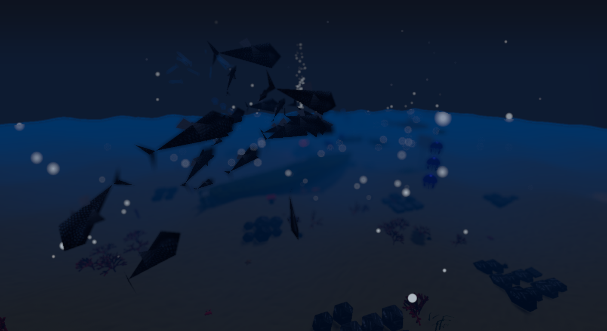
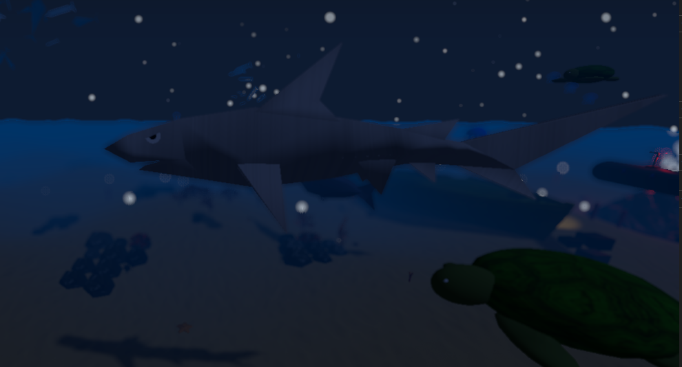
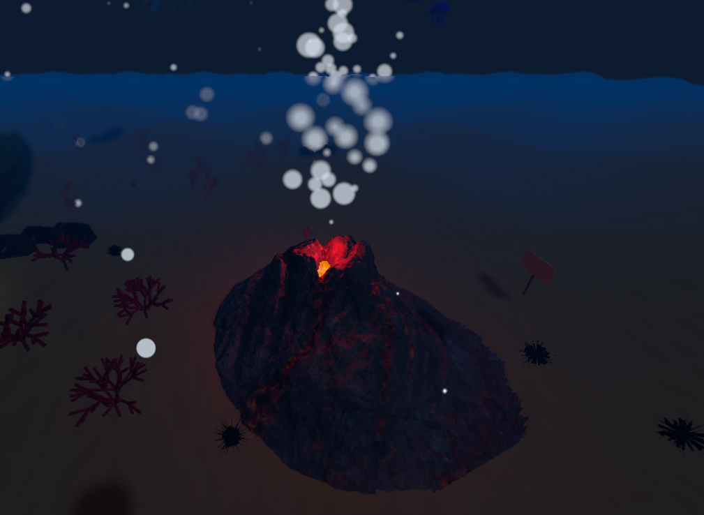
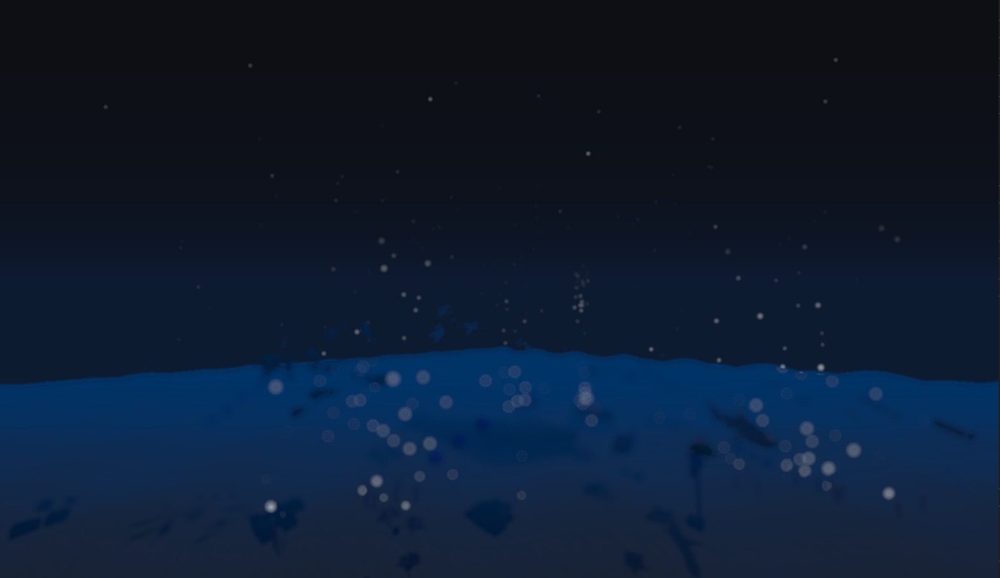
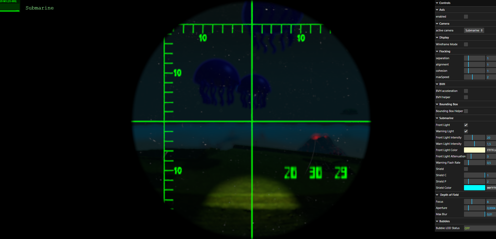

# SGI 2025/2026 - PW2

## Group T03G01
| Name             | Number    | E-Mail             |
| ---------------- | --------- | ------------------ |
| Lucas Faria      | 202207540 | up202207540@up.pt  |
| Alexandre Lopes  | 202207015 | up202207015@up.pt  |
| Pedro Borges     | 202207552 | up202207552@up.pt  |
----

----

## Project Overview

This project creates an immersive **underwater marine ecosystem** using Three.js, featuring realistic 3D models, advanced shaders, particle systems, and interactive elements. The scene simulates an ocean environment complete with marine life, geological features, and dynamic visual effects.

### Main Features
- **Marine Life:** School of fish, sharks, swordfish, turtles, jellyfish, crabs, sea stars, and sea urchins
- **Environment:** Ocean floor with wavy sand, rocks, coral reefs, sea plants, a sunken boat and water surface
- **Geological Features:** Underwater volcano with lava shader effects
- **Visual Effects:** Marine snow particles, bubble particles, sand puff system
- **Interactive Elements:** Submarine with crosshair targeting system, UI
- **Advanced Rendering:** Multiple cameras, LOD systems, post-processing effects
- **Custom Shaders:** Tint, Crosshair, Perlin Noise, Spritesheet HUD, Lava Movement, Texture Overlay, Circular Clip

----

## Design Choices & Implementation Details

### Architecture & Scene Organization
- **Modular Design:** Each element (animals, objects, particles) is implemented as a separate class for maintainability
- **Scene Hierarchy:** Logical grouping of objects (coral reefs, rock groups, plant groups, schools of fish)
- **Separation of Concerns:** MyApp handles rendering/camera management, MyContents manages scene objects, MyInterface handles GUI

### Shader Implementations

#### 1. **TintShader**
- **Purpose:** Applies a greenish-yellowish underwater color grading to simulate ocean depth
- **Implementation:** Post-processing shader that multiplies scene colors with a tint color
- **Usage:** Enhances underwater atmosphere

#### 2. **CrosshairShader**
- **Purpose:** Displays a customizable crosshair for submarine targeting
- **Implementation:** Overlays a texture on screen, converts black pixels to green color
- **Features:** Configurable scale, aspect ratio correction, centered positioning

#### 3. **PerlinNoiseGLSL**
- **Purpose:** Generate procedural organic noise patterns to simulate bioluminescent coral effects and natural movement
- **Implementation:** Classic 3D Perlin noise function integrated into vertex and fragment shaders. Vertex shader creates gentle swaying motion for coral structures, fragment shader produces multi-layered noise for bioluminescent color pulsing and hue shifting
- **Features:** Textureless noise generation, time-animated continuous variation, height-based movement influence, smooth gradients using fade functions

#### 4. **SpritesheetHUDShader**
- **Purpose:** Displays HUD elements from spritesheet textures
- **Implementation:** Converts white/bright pixels to green color for HUD consistency
- **Usage:** Numerical displays and UI elements

#### 5. **LavaSimpleMovement**
- **Purpose:** Creates animated lava effect for volcano
- **Implementation:** Uses time-based sine waves to distort texture UVs
- **Features:** Multiple wave frequencies for more realistic movement, color mixing with base lava color

#### 6. **TextureOverlayShader**
- **Purpose:** Blends textures onto the scene
- **Implementation:** Alpha-blended texture overlay with configurable opacity

#### 7. **CircularClipShader**
- **Purpose:** Creates circular vignette or spotlight effects
- **Implementation:** Clips pixels outside a circular region with smooth falloff

### Particle Systems

#### Marine Snow Particles
- Simulates organic particulate matter falling through water column
- Uses custom textures (snowflake sprites)
- Realistic sinking motion with slight horizontal drift

#### Bubble Particles
- Creates rising bubbles from sea floor and volcanic activity
- Upward motion with wobble effect for realism
- Varying bubble sizes and speeds

#### Sand Puff System
- Triggered by objects/creatures or users interacting with sea floor
- Short-lived particle bursts
- Simulates sediment disturbance

### Optimizations

#### Level of Detail (LOD)
- Multiple LOD levels for complex geometry
- Automatic switching based on camera distance
- Reduces polygon count for distant objects

#### BVH (Bounding Volume Hierarchy)
- Accelerated raycasting using three-mesh-bvh library
- Enables efficient object picking/interaction
- Improves performance for complex scenes with many objects

#### Texture Management
- Efficient texture loading and reuse
- Appropriate texture resolutions for different objects
- Normal maps, roughness maps for realistic materials

### Animation Systems

#### Keyframe Animations
- Custom keyframe animation system (MyKeyFrameAnimation)
- Used for submarine patrol routes and marine life movements
- Smooth interpolation between keyframes

#### Procedural Animations
- Fish school flocking behavior
- Jellyfish pulsing motion
- Turtle swimming patterns
- All implemented with mathematical functions for realistic movement

### Cameras & Views
- **Multiple Camera Perspectives:** Orthographic and perspective cameras
- **OrbitControls:** Smooth camera navigation
- **Post-Processing Pipeline:** EffectComposer with BokehPass for depth of field
- **Camera Switching:** Runtime camera changes via GUI

### Lighting Design
- **Ambient Light:** Subtle blue tint (0x88aaff) for underwater mood
- **Directional Light:** Simulates filtered sunlight from surface, submarine front light
- **Point Light:** Red-orange light for volcano lava glow, submarine periscope
- **Shadow Mapping:** Enabled for directional light with optimized settings

### Additional Information
- Some textures with resolutions exceeding 1024x1024 (boat and volcano) were used at their original size. After testing, we found that reducing these textures negatively impacted the visual quality of these objects. Since they are decorative and non-critical to core functionality, we prioritized visual fidelity over the minor performance impact.

----

## Screenshots

### Main Scene Overview

*Complete underwater ecosystem with marine life and geological features*

### Marine Life

*Dynamic school of fish with flocking behavior*

*Detailed shark model with realistic textures*

### Volcanic Activity

*Underwater volcano with custom lava shader*

### Particle Systems

*Marine snow and bubble particle effects*

### Submarine View

*Submarine with crosshair targeting system*

----

## Known Limitations & Issues

### Performance
- Scene can be demanding with all effects enabled on lower-end hardware
- Many simultaneous particle systems may reduce framerate

### Visual Artifacts
- Occasional z-fighting on overlapping geometry (coral/rocks)
- Water surface transparency could be more realistic

### Features Not Implemented
- **All the features were implemented.**

### Minor Issues
- Camera controls occasionally clip through geometry
- LOD transitions can be noticeable in some cases

----

## Work Distribution

### Lucas Faria (202207540)
**Primary Responsibilities:**

**Contributions:**

### Alexandre Lopes (202207015)
**Primary Responsibilities:**

**Contributions:**

### Pedro Borges (202207552)
**Primary Responsibilities:**

**Contributions:**

### Collaborative Work
- **All Members:** Scene integration, testing, debugging
- **All Members:** Documentation
- **All Members:** Code review and optimization suggestions
- **All Members:** Design decisions and feature planning

----

## How to Run

1. Ensure you have a modern web browser with WebGL support
2. Open [index.html](index.html) in your browser
3. Use mouse to orbit camera (left-click drag), zoom (scroll), and pan (right-click drag)
4. Interact with GUI controls to adjust settings and switch cameras
5. Click on objects for interaction/selection

## Technologies Used
- **Three.js:** 3D graphics library
- **WebGL:** Hardware-accelerated 3D rendering
- **GLSL:** Custom shader programming
- **three-mesh-bvh:** Accelerated raycasting
- **lil-gui:** GUI controls
- **GLTFLoader:** 3D model loading

----

## References & Assets
- Three.js Documentation: https://threejs.org/docs/
- Texture sources: Various PBR texture libraries
- GLTF Models: Custom created and from free repositories
- Shader programming: GLSL specifications and Three.js examples
